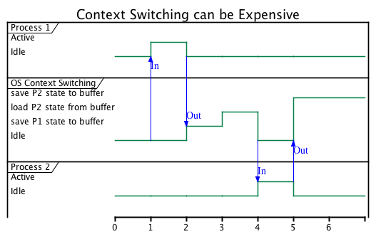

IOT Server K8S Tutorial Background Talk
---

### Computer Architecture

  (10 minutes)

  Review basic computer architecture 

  * [Von Neumann](https://en.wikipedia.org/wiki/Von_Neumann_architecture) and CPU, Memory, I/O
  * Kernel Space / User Space
    * ring 0
    * ring 1,2,3 (your apps are in 3)
  * Processes ([specifically Linux processes](http://www.tldp.org/LDP/tlk/kernel/processes.html))
    * Process state includes:
      1. instructions
      2. data
      3. counter
      4. CPU Registers
      5. process stacks (temp data, routine params, return addresses, saved variables)
    * `ps waux`
    * Typical IO
      1. The operating system reads data from the disk into pagecache in kernel space.
      2. The application reads the data from kernel space into a user-space buffer.
      3. The application writes the data back into kernel space into a socket buffer.
      4. The operating system copies the data from the socket buffer to the NIC buffer where it is sent over the network.
    * Typical Multi-Programming
      1. [Context switching](http://www.linfo.org/context_switch.html) can be expnsive.
      2. Form a mental model of constantly storing and restoring process state when you have more processes than CPUs
      3. 

### Container

  (15 minutes)

  #### “container” is a term to describe a combination of Linux namespaces and control groups

  Containers are not a thing!  See https://blog.jessfraz.com/post/containers-zones-jails-vms/ and http://containersummit.io/events/nyc-2016/videos/building-containers-in-pure-bash-and-c

  * Most definitions of "container" on the Internet are unhelpful.  They confuse 3 separate concepts: packaging and launching and container.  
  * Avoid the term "virtualization" when thinking about containers - containers are using the host OS directly (sort of, for now...)
  * Keep in mind what you know about processes above when thinking about containers
    1. older resource monitoring approches still work with containers (but the process names and hard to parse)
    2. tools like docker help you deal with the long ugly opaque process and file names you see with older tools like ps

  #### [Container Lab](CONTAINERS.md)

### Virtual Machine

  (5 minutes)

  A virtual machine is a software computer.

  * gen1 apps that implement OS APIs
  * gen2 hypervisors
  * next gen containers
    * get security with direct help from hypervisors
    * example: Intel Clear Container - Kata
    * so, not really containers but fast-loading-VMs that *look* like containers (see CRI)
  * remember, VMs run in other VMs all the time: think a JVM on a Linux host running on a hypervisor

### Docker

  (5 minutes)

  Packaging and launching suport for containers.

### Container Orchestration

  (5 minutes)

  Service discovery, restart, failover, scaling tools, disk management.

  * The Docker daemon usually controlls the containers on a single VM
  * The Orchestration Framework remote controlls all the docker daemons in cluster
  * Kubernetes, Mesosphere DCOS, hyper.sh, Docker Swarm

